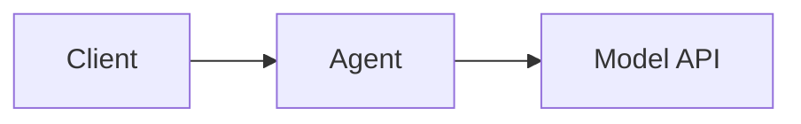

# Documentation Instructions

## Quick Reference
```bash
cd docs
npm install                    # Install dependencies
npm run dev                    # Start dev server (localhost:5173)
npm run build                  # Build static site
npm run preview                # Preview build locally
```

Or use the Makefile:
```bash
make install dev build preview clean
```

## Project Structure
```
docs/
├── .vitepress/
│   ├── config.ts              # VitePress config (mermaid, nav, sidebar)
│   ├── theme/
│   │   ├── index.ts           # Theme customization
│   │   └── custom.css         # Custom styles
│   ├── dist/                  # Build output (gitignored)
│   └── cache/                 # Build cache (gitignored)
├── public/                    # Static assets (copied as-is)
│   ├── logo.svg
│   ├── redirect-index.html    # Root redirect to /latest/
│   └── demo.gif
├── package.json
├── Makefile                   # Convenience commands
└── [content directories]/     # Markdown content
```

## Multi-Version Documentation

### How It Works
1. `docs.yaml` workflow deploys `/dev/` on main branch pushes
2. `release.yaml` workflow deploys `/vX.Y.Z/` and updates `/latest/` on version tags
3. Version dropdown is dynamically built from git tags via `VERSIONS_JSON` env var

### Key Environment Variables
| Variable | Example | Description |
|----------|---------|-------------|
| `DOCS_VERSION` | `dev`, `1.0.0` | Version shown in navbar |
| `DOCS_BASE` | `/kaos/dev/` | Base path for assets/links |
| `VERSIONS_JSON` | `["1.0.0","0.9.0"]` | Available versions for dropdown |

### Testing Version Builds Locally
```bash
DOCS_VERSION=1.0.0 DOCS_BASE=/kaos/v1.0.0/ npm run build
```

## Mermaid Diagrams

Mermaid diagrams are supported via `vitepress-plugin-mermaid`. Use standard mermaid code blocks:

~~~markdown

~~~

### Mermaid Tips
- Test diagrams at https://mermaid.live before adding to docs
- Avoid complex diagrams that don't render well on mobile
- Mermaid config is in `config.ts` under `mermaid` key

## Making Documentation Changes

### Adding New Pages
1. Create `.md` file in appropriate directory
2. Add to sidebar in `.vitepress/config.ts`
3. Test locally with `npm run dev`

### Modifying Config
- **Navbar/Sidebar**: Edit `config.ts` `nav` and `sidebar` sections
- **Styling**: Edit `theme/custom.css`
- **Mermaid**: Config in `config.ts` `mermaid` section

### Common Issues

#### Version Dropdown Not Working
- Dropdown links are absolute URLs to `axsaucedo.github.io/kaos/`
- When testing locally, version switching won't work (expected)
- Verify correct versions in GitHub Actions build logs

#### Dead Link Warnings
- `ignoreDeadLinks: true` is set to allow cross-version links
- External links to other versions may 404 locally

#### Mermaid Not Rendering
- Ensure `vitepress-plugin-mermaid` is in package.json
- Check diagram syntax at https://mermaid.live
- Run `npm install` to update dependencies

## Retrospective Version Rebuilds

When docs infrastructure changes (e.g., adding mermaid support), existing version docs need rebuilding.

### Rebuild a Single Version
```bash
# Option 1: Re-run release workflow from GitHub UI
# Go to Actions > Release > select tag > Re-run all jobs

# Option 2: Force-push the tag to trigger workflow
git checkout v1.0.0
git checkout -b rebuild-v1.0.0
# Cherry-pick infrastructure changes from main
git cherry-pick <commit-hash>
git tag -f v1.0.0
git push origin v1.0.0 --force
```

### Rebuild All Versions
For bulk rebuilds, use the GitHub Actions workflow manually or run:
```bash
# List versions
make list-tags

# For each version, re-trigger the release workflow via GitHub UI
```

### Important: What Gets Rebuilt
- Only files in `docs/` are rebuilt
- Version-specific content should NOT be changed
- Only infrastructure changes (mermaid, theme, etc.) should be cherry-picked

## CI/CD Integration

### Workflows
| Workflow | Trigger | Deploys To |
|----------|---------|------------|
| `docs.yaml` | Push to main (docs/) | `/dev/` |
| `release.yaml` | Version tag push | `/vX.Y.Z/` + `/latest/` |

### Deployment Structure
```
gh-pages branch:
├── index.html          # Redirect to /latest/
├── dev/                # Latest main branch
├── latest/             # Symlink to newest version
├── v1.0.0/             # Version-specific builds
├── v0.9.0/
└── charts/             # Helm chart repository
```

## Testing Checklist

Before pushing docs changes:
- [ ] `npm run build` succeeds without errors
- [ ] `npm run preview` shows content correctly
- [ ] Mermaid diagrams render (if applicable)
- [ ] Navigation links work
- [ ] Mobile layout looks acceptable

For infrastructure changes:
- [ ] Test with different `DOCS_VERSION` and `DOCS_BASE` values
- [ ] Verify version dropdown shows correct items
- [ ] Check that `redirect-index.html` still works
