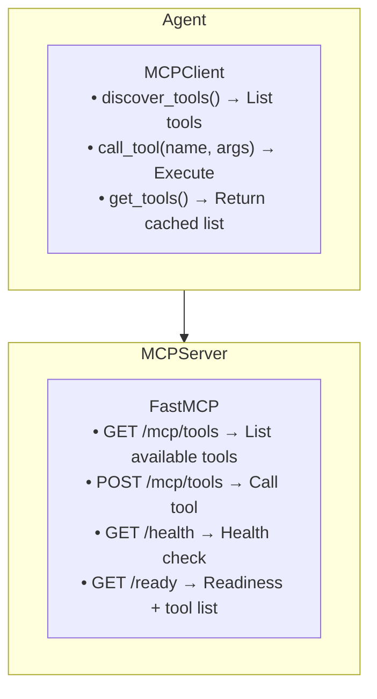

# MCP Tools

The Model Context Protocol (MCP) integration enables agents to discover and call external tools hosted on MCP servers.

## Architecture



## MCPClient

Client for discovering and calling tools on MCP servers.

### Configuration

```python
from mcptools.client import MCPClient

# Create client with name and URL
client = MCPClient(name="my-server", url="http://localhost:8001")
```

### Discover Tools

The client uses lazy initialization - tools are discovered automatically on first use:

```python
# Tools are discovered automatically when needed
# Or manually initialize with _init()
await client._init()

for tool in client.get_tools():
    print(f"{tool.name}: {tool.description}")
    print(f"  Parameters: {tool.parameters}")
```

### Call Tool

```python
result = await client.call_tool(
    name="echo",
    args={"text": "Hello, world!"}
)
print(result)  # {"result": "Echo: Hello, world!"}
```

### Tool Data Structure

```python
@dataclass
class Tool:
    name: str              # Tool identifier
    description: str       # Human-readable description
    parameters: Dict       # JSON Schema of parameters
```

## MCPServer

Server for hosting tools via FastMCP protocol.

### Configuration

```python
from mcptools.server import MCPServer, MCPServerSettings

settings = MCPServerSettings(
    mcp_host="0.0.0.0",
    mcp_port=8000,
    mcp_tools_string="",     # Dynamic tools (optional)
    mcp_log_level="INFO"
)

server = MCPServer(settings)
```

### Register Tools Programmatically

```python
def echo(text: str) -> str:
    """Echo the input text back."""
    return f"Echo: {text}"

def calculate(expression: str) -> str:
    """Evaluate a mathematical expression."""
    return str(eval(expression))

server.register_tools({
    "echo": echo,
    "calculate": calculate
})
```

### Register Tools from String

For dynamic tool creation (used in Kubernetes):

```python
tools_string = '''
def echo(text: str) -> str:
    """Echo the input text back."""
    return f"Echo: {text}"

def add(a: int, b: int) -> int:
    """Add two numbers."""
    return a + b
'''

server.register_tools_from_string(tools_string)
```

### Run Server

```python
server.run(transport="http")
```

## Environment Variable Configuration

For Kubernetes deployment, tools can be defined via environment variable:

```bash
export MCP_TOOLS_STRING='
def echo(text: str) -> str:
    """Echo the input text."""
    return f"Echo: {text}"
'
```

The server automatically registers tools from `MCP_TOOLS_STRING` on startup.

## Tool Definition Guidelines

### Type Annotations

Tools must use type annotations for parameters:

```python
# Supported types
def my_tool(
    text: str,           # String
    count: int,          # Integer
    data: dict,          # Dictionary
    items: list          # List
) -> str:
    ...
```

### Docstrings

Docstrings are used as tool descriptions:

```python
def search(query: str) -> str:
    """Search for information using the query string.
    
    Args:
        query: The search query to execute
        
    Returns:
        Search results as a string
    """
    return f"Results for: {query}"
```

### Error Handling

Tools should handle errors gracefully:

```python
def safe_divide(a: int, b: int) -> str:
    """Safely divide two numbers."""
    if b == 0:
        return "Error: Division by zero"
    return str(a / b)
```

## Kubernetes MCPServer CRD

### Using PyPI Package

```yaml
apiVersion: kaos.tools/v1alpha1
kind: MCPServer
metadata:
  name: echo-server
spec:
  type: python-runtime
  config:
    mcp: "test-mcp-echo-server"  # PyPI package name
```

### Using Dynamic Tools

```yaml
apiVersion: kaos.tools/v1alpha1
kind: MCPServer
metadata:
  name: calc-server
spec:
  type: python-runtime
  config:
    toolsString: |
      def add(a: int, b: int) -> int:
          """Add two numbers."""
          return a + b
      
      def multiply(a: int, b: int) -> int:
          """Multiply two numbers."""
          return a * b
```

## Integration with Agent

### Connecting Agent to MCP

```python
from agent.client import Agent
from mcptools.client import MCPClient
from modelapi.client import ModelAPI

# Create MCP client
mcp_client = MCPClient(name="my-tools", url="http://localhost:8001")

# Create agent with MCP client (tools are discovered automatically)
agent = Agent(
    name="tool-agent",
    model_api=ModelAPI(model="gpt-4", api_base="http://localhost:8000"),
    mcp_clients=[mcp_client],
    instructions="Use the available tools to help users."
)
```

### How Agent Uses Tools

1. Agent builds system prompt with tool descriptions
2. LLM responds with `tool_call` block when appropriate
3. Agent parses tool name and arguments
4. Agent calls `execute_tool()` which routes to correct MCP client
5. Result is added to conversation
6. Loop continues until final response

## Testing

### Mock MCP Server

```python
import pytest
from mcptools.server import MCPServer, MCPServerSettings

@pytest.fixture
async def mcp_server():
    settings = MCPServerSettings(mcp_port=8001)
    server = MCPServer(settings)
    
    def echo(text: str) -> str:
        return f"Echo: {text}"
    
    server.register_tools({"echo": echo})
    
    # Start server in background
    # ... test code ...
```

### Verify Tool Discovery

```python
async def test_tool_discovery():
    client = MCPClient(name="test-server", url="http://localhost:8001")
    await client._init()  # Discover tools
    
    tools = client.get_tools()
    assert len(tools) > 0
    assert "echo" in [t.name for t in tools]
```
